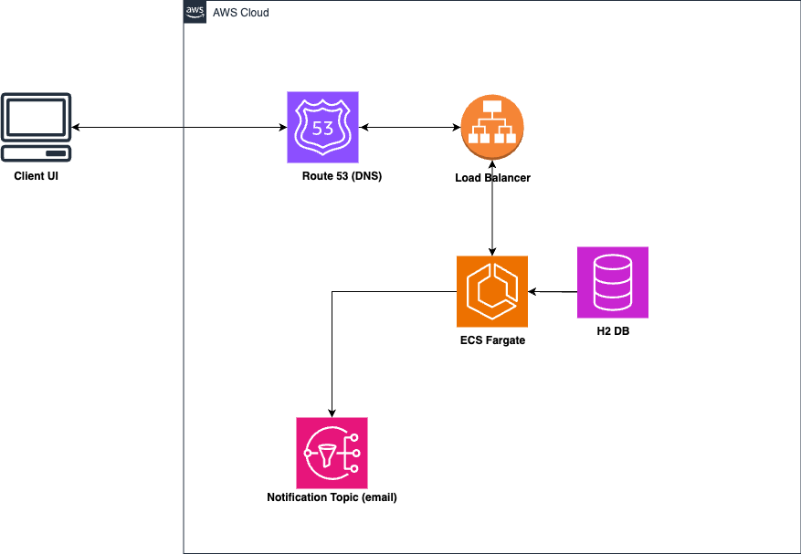

# Bank Account Withdrawal Service
## Overview
This application simulates a bank account withdrawal service using an in-memory database.
By default, the ***account ID = 1*** is initialized (deposited) with a balance of R100.
Clients can request withdrawals from their or default accounts.

## 1. Architecture

*High level deployment architecture approach*

The application is built using Spring Boot framework, which provides a robust foundation for Java applications. 
Here's a breakdown of the architecture and key components.The application will use  figure 1. above (high level architecture deployment approach).
- **Controller**: Handles incoming HTTP requests, delegates to the service layer, and manages responses.
- **Service**: Contains business logic, including withdrawal processing, validation, and interaction with the repository.
- **Repository**: Interface for data access operations, interacting with the in-memory database.
- **Mode**l: Defines entities like Account with attributes such as balance.
- **Exception Handling**: Custom exceptions (AccountNotFoundException, InsufficientFundsException) manage error scenarios gracefully.

## 1. AWS SNS Configuration
Configure AWS SNS integration for publishing withdrawal events(notification via email/sms), 
Ensure that your SNS Topic subscribes to SMS/Email notification.

- Set the following properties in your application configuration:
***application.properties***
`````
aws.region=your_region
aws.account-id=your_account_id
aws.topic-name=bank_notification_topic_name
`````
These properties are used to dynamically construct the SNS topic ARN (arn:aws:sns:your_region:your_account_id:bank_notification_topic_name) needed for publishing events.
## 2. Run the Application: 
Ensure the application is running locally or deployed on a server accessible via HTTP.
open the Terminal
`````
mvn clean package
mvn spring-boot:run
`````
## 3. Swagger UI
Open a web browser and navigate to the following URL:

http://localhost:8080/api/swagger-ui.html

***Note: Replace port:8080 with your application's port if different.***

### Explore Endpoints: 
Swagger UI provides a user-friendly interface listing all available endpoints, request parameters, and response structures. You can interact with the API directly from this interface:

## 4. Future Enhancements
1. **Security**: Implement authentication and authorization mechanisms.
2. **Monitoring**: Integrate monitoring tools for performance and health checks.
3. **Caching**: Introduce caching mechanisms to improve response times for read-heavy operations.
4. **Asynchronous Processing**: Use messaging queues for handling withdrawal requests asynchronously.